# Trend Micro Test - Calendar and DatePicker

## Installation

installed dependencies via yarn:

```
yarn
```

## Development mode

```
yarn dev
```

Demo page will show on http://localhost:3000

## Production mode

```
yarn build
```

You can simply install and use [serve](https://github.com/vercel/serve) to serve a static server on localhost

```
yarn global add serve
serve -s dist
```

## Screenshots

- Calendar

|           | desktop                                            | mobile                                            |
| --------- | -------------------------------------------------- | ------------------------------------------------- |
| DateView  | 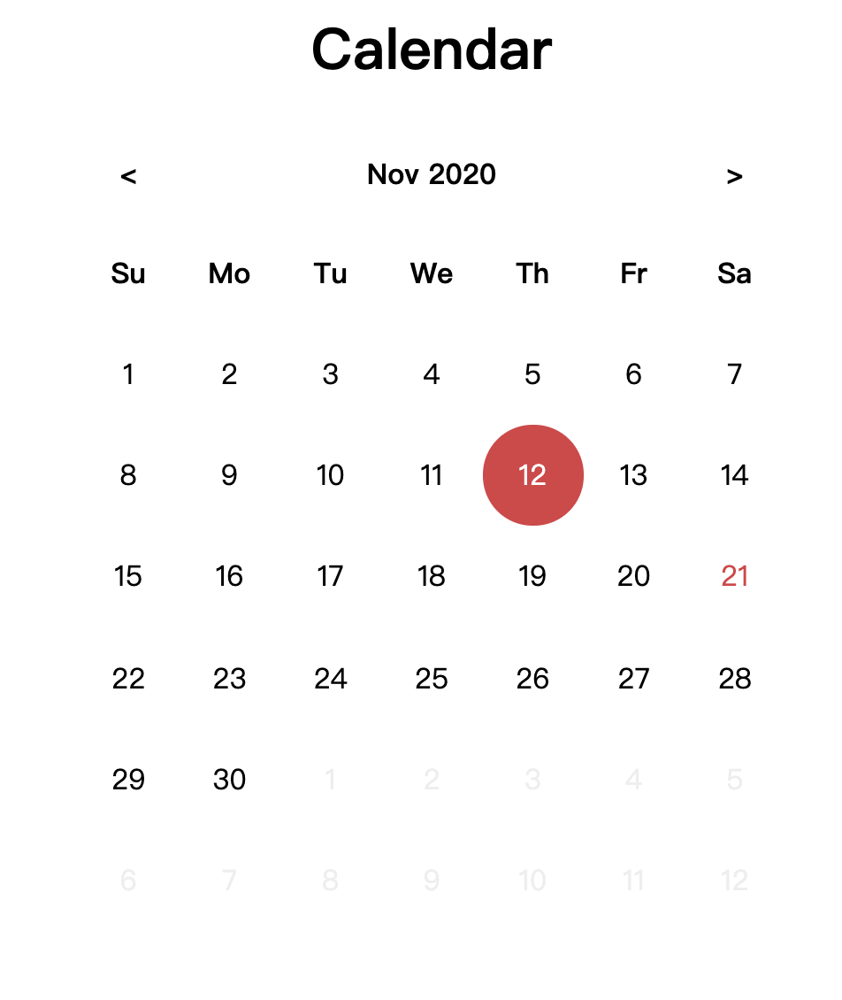  | 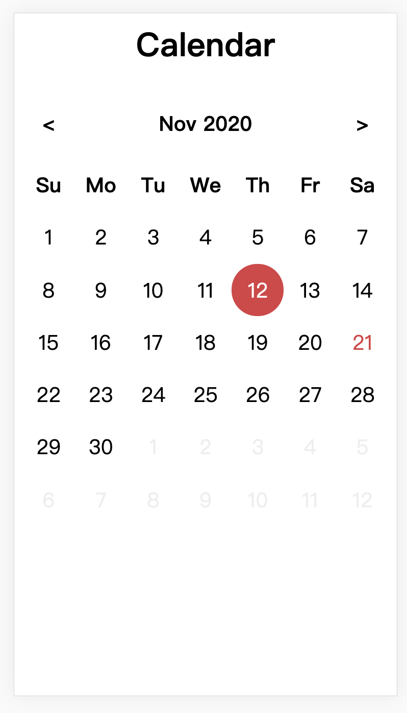  |
| MonthView | 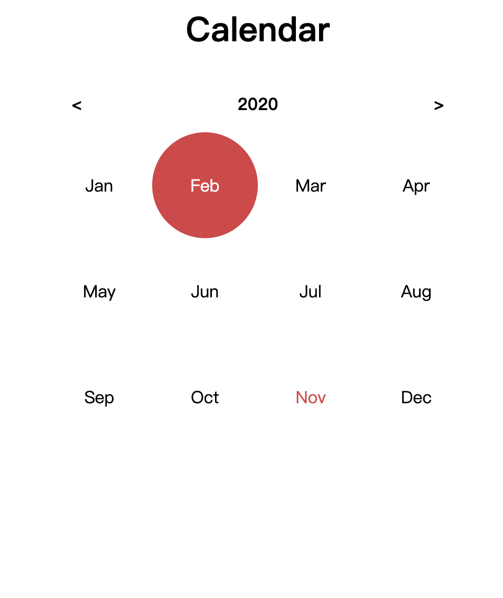 | 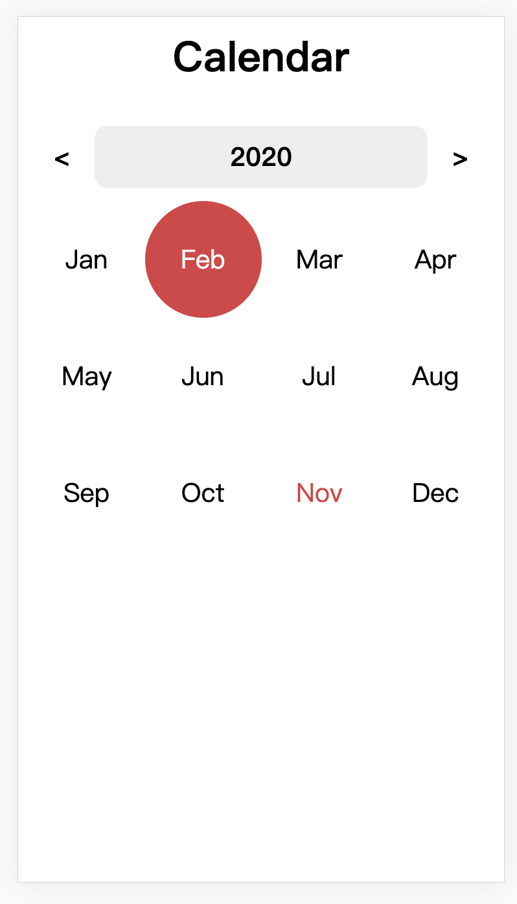 |
| YearView  | 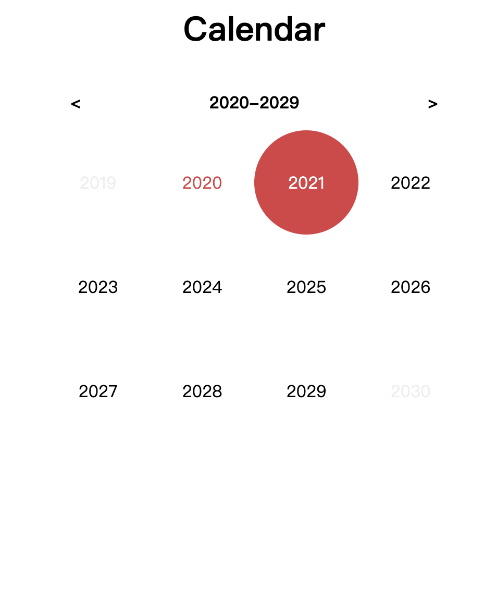  | 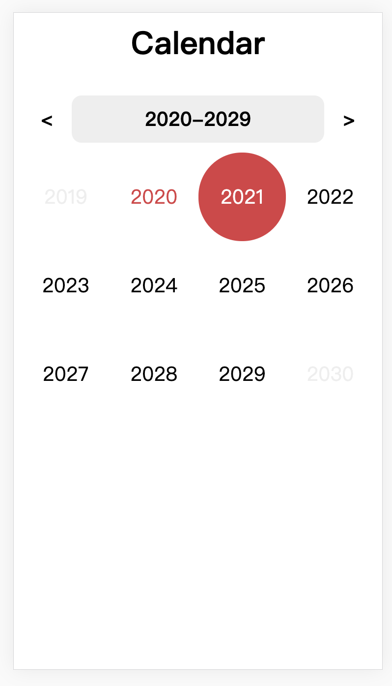  |

- DatePicker

|           | desktop                                                | mobile                                                |
| --------- | ------------------------------------------------------ | ----------------------------------------------------- |
| Initial   | 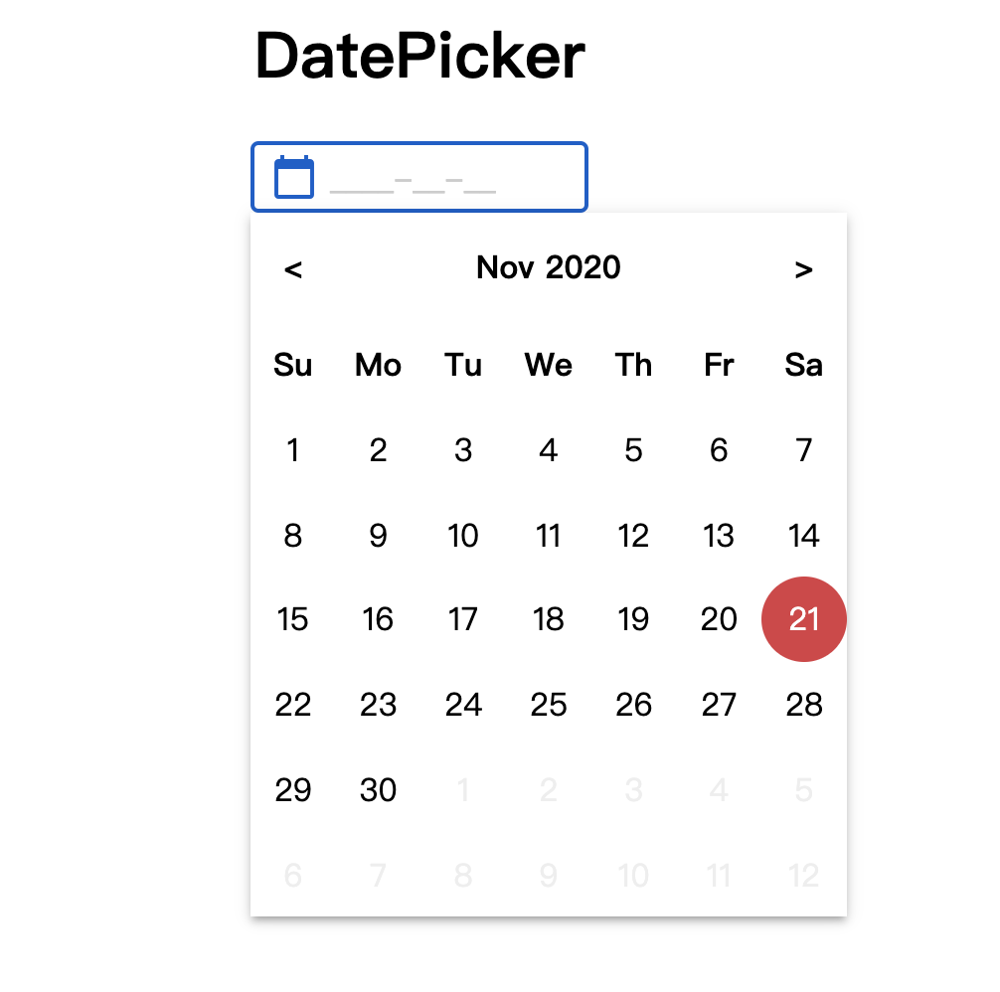 | 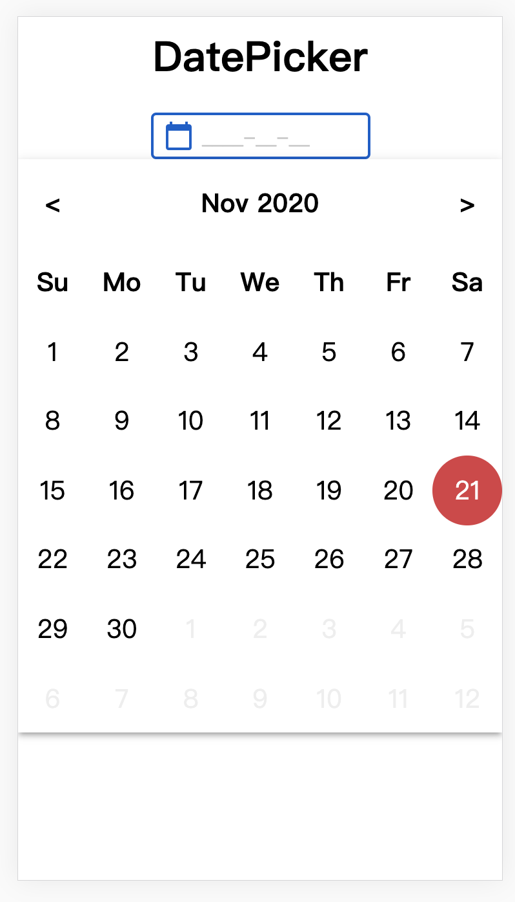 |
| DateView  | 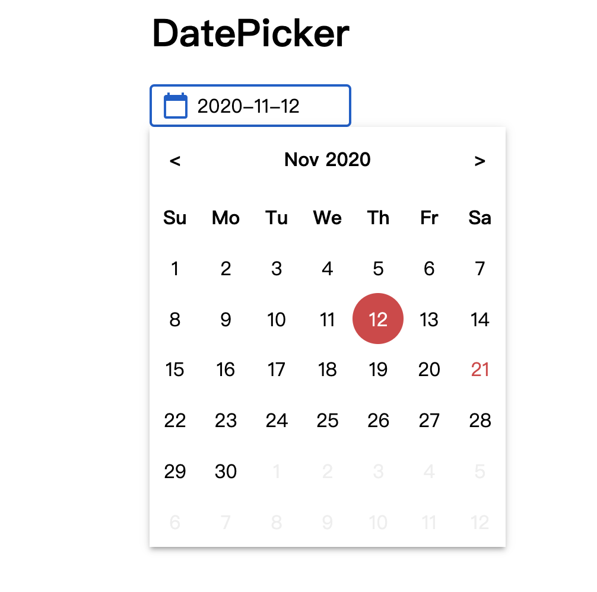    | 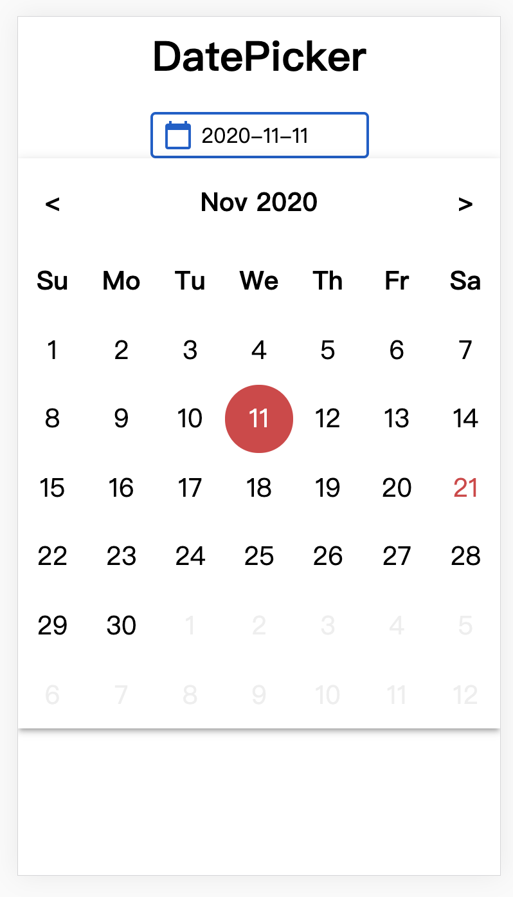    |
| MonthView | 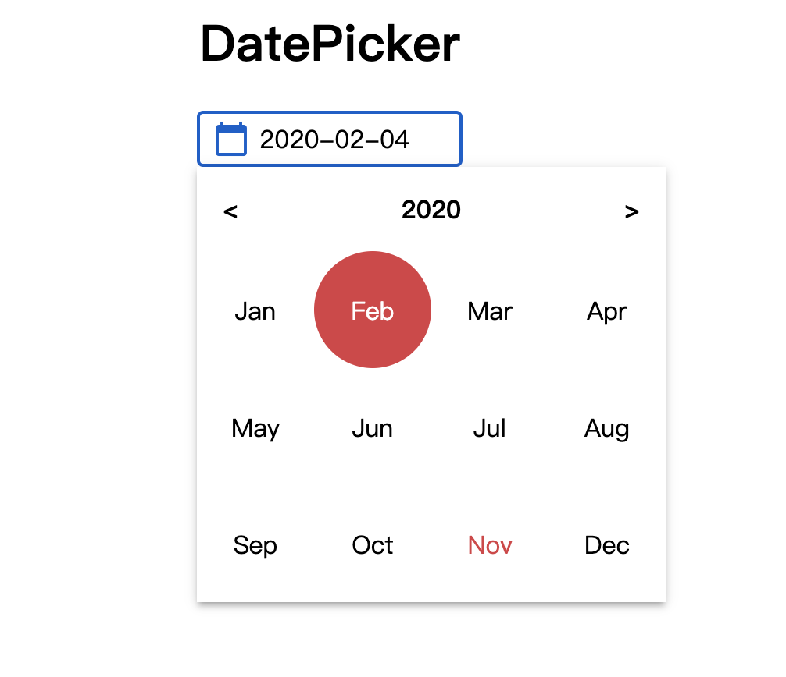   | 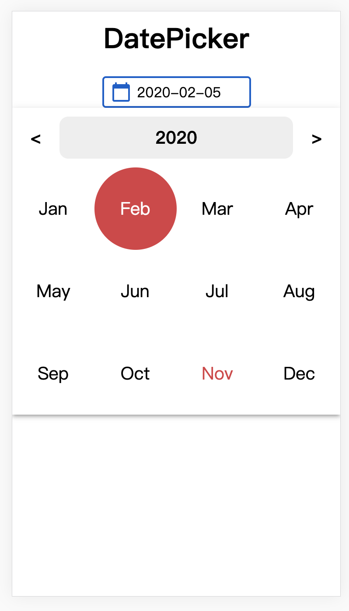   |
| YearView  |     | 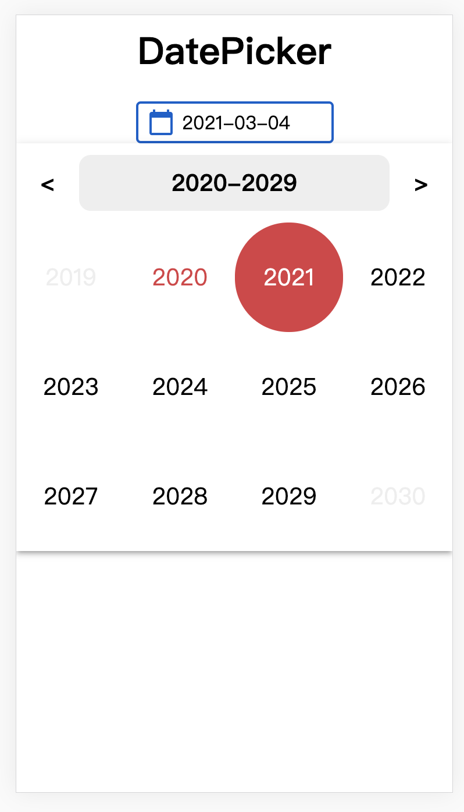    |
